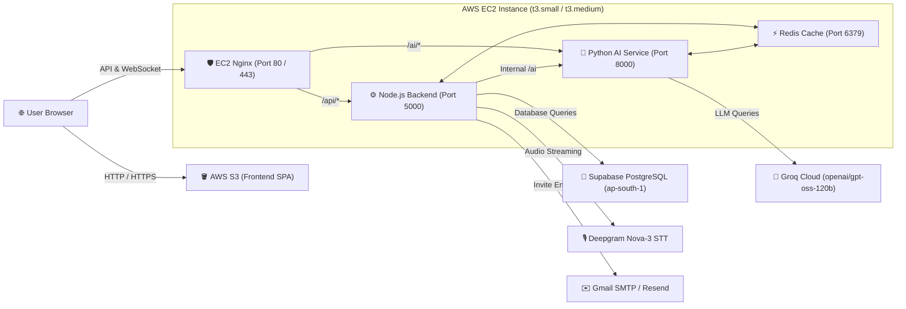

# 🚀 Communication Readiness Platform — AWS Deployment Guide

This guide details how to deploy the platform across AWS:
- **Backend & AI Service** → **AWS EC2** (Docker Compose with Nginx Gateway, Node.js API, Python AI Service, Redis)
- **Frontend SPA** → **AWS S3 Static Website Hosting** (React 19 + Vite bundle with SPA routing)
- **Database** → **Supabase PostgreSQL** (Already active in `ap-south-1`)

---

## 🏗️ Architecture Overview



---

## 📋 Prerequisites
1. An AWS Account with permissions to create **EC2 instances** and **S3 buckets**.
2. AWS CLI installed on your machine (`aws --version`).
3. Your EC2 Key Pair (`.pem` file) for SSH access.

---

## Part 1: Deploy Backend & AI Service to EC2

### Step 1: Launch the EC2 Instance
1. Go to **AWS Console** → **EC2** → **Launch Instance**.
2. **Name**: `crp-backend-ai-production`
3. **AMI**: **Ubuntu Server 22.04 LTS (HVM)** or **Ubuntu Server 24.04 LTS**.
4. **Instance Type**:
   - `t3.small` (2 vCPU, 2 GB RAM) — minimum recommended.
   - `t3.medium` (2 vCPU, 4 GB RAM) — recommended for production concurrency.
5. **Key Pair**: Select your existing `.pem` key pair or create a new one.
6. **Network / Security Group**:
   Create a Security Group with the following inbound rules:
   | Type | Port | Protocol | Source | Description |
   | :--- | :--- | :--- | :--- | :--- |
   | **SSH** | 22 | TCP | `My IP` (or `0.0.0.0/0`) | SSH Administration |
   | **HTTP** | 80 | TCP | `0.0.0.0/0` | Public Web & API traffic |
   | **HTTPS** | 443 | TCP | `0.0.0.0/0` | SSL traffic (if custom domain) |
   | **Custom TCP** | 5000 | TCP | `0.0.0.0/0` (Optional) | Direct backend access |
7. **Storage**: **20 GiB gp3** SSD.
8. Click **Launch Instance**. Copy the **Public IPv4 address** (e.g., `13.232.12.34`).

---

### Step 2: Connect to your EC2 Instance
Open your terminal (PowerShell or Git Bash) and connect using your `.pem` key:
```bash
ssh -i "path/to/your-key.pem" ubuntu@<YOUR-EC2-PUBLIC-IP>
```

---

### Step 3: Clone Code or Transfer Files
On the EC2 instance, clone your repository:
```bash
git clone <YOUR_GIT_REPOSITORY_URL> crp
cd crp
```
*(Or transfer the project directory from your computer via `scp -i your-key.pem -r . ubuntu@<YOUR-EC2-PUBLIC-IP>:~/crp`)*

---

### Step 4: Run the Automated Setup Script
We've prepared an automated script that installs Docker, prepares environment files, builds all containers, and starts the Nginx reverse proxy:
```bash
chmod +x deploy/ec2/setup-ec2.sh
./deploy/ec2/setup-ec2.sh
```

#### What this script automatically configures:
- **Nginx Reverse Proxy**:
  - Exposes port 80.
  - Routes `/api/*` to the Node.js backend.
  - Routes `/ai/*` to the Python FastAPI AI service.
  - Configures WebSocket upgrade headers (`Upgrade`, `Connection: upgrade`).
  - Sets client max body size to `50M` for audio recordings.
- **Node.js Backend**:
  - Configured with Supabase PostgreSQL connection pooler (`ap-south-1`).
  - Connected to Deepgram Nova-3 API key.
  - Connected to Gmail SMTP (`danishbasha18@gmail.com`).
  - Automatically runs database migrations upon startup.
- **Python AI Service**:
  - Configured with Groq API key and `openai/gpt-oss-120b` model.
  - Connected to Redis for knowledge & skill-gap caching.

---

### Step 5: Verify EC2 Deployment
On the EC2 instance or from your browser:
```bash
# Check running containers
sudo docker compose -f docker-compose.prod.yml ps

# Test Nginx Gateway Health
curl http://localhost/health
# Expected: {"status":"healthy","service":"crp-gateway"}

# Test Backend API Health
curl http://localhost/api/auth/login
```

From your local computer:
Open `http://<YOUR-EC2-PUBLIC-IP>/health` in your browser. You should see:
```json
{"status":"healthy","service":"crp-gateway"}
```

---

## Part 2: Deploy Frontend to AWS S3

### Step 1: Configure AWS CLI on your Local PC
Run in PowerShell:
```powershell
aws configure
```
Enter your:
- **AWS Access Key ID**: `AKIA...`
- **AWS Secret Access Key**: `...`
- **Default region name**: `ap-south-1`
- **Default output format**: `json`

Verify authentication:
```powershell
aws sts get-caller-identity
```

---

### Step 2: Deploy Frontend using the Automated Script
Run the PowerShell deployment script from the project root:

```powershell
.\deploy\s3\deploy-s3.ps1 `
  -BucketName "crp-frontend-production" `
  -ApiUrl "http://<YOUR-EC2-PUBLIC-IP>" `
  -Region "ap-south-1"
```

*(On Linux / Mac / Git Bash, use `./deploy/s3/deploy-s3.sh crp-frontend-production http://<YOUR-EC2-PUBLIC-IP> ap-south-1`)*

#### What this script does automatically:
1. Creates the S3 bucket if it doesn't already exist.
2. Disables "Block Public Access" on the S3 bucket.
3. Enables **Static Website Hosting** with:
   - **Index document**: `index.html`
   - **Error document**: `index.html` (crucial for React SPA routing).
4. Applies a public-read bucket policy (`s3:GetObject`).
5. Injects `VITE_API_URL=http://<YOUR-EC2-PUBLIC-IP>` and compiles the production bundle (`dist/`).
6. Syncs assets to S3 with cache optimization (`max-age=1yr` for hashed assets, `no-cache` for `index.html`).
7. Outputs the live website URL!

---

### Step 3: Access your Live Application
Open the URL printed by the script:
```
http://<bucket-name>.s3-website.ap-south-1.amazonaws.com
```

Log in with your Platform Owner credentials:
- **Email**: `danishbasha18@gmail.com`
- **Password**: `TAPTOPAy786`

---

## 🔒 Production Enhancements (Custom Domain & SSL)

### Adding HTTPS via CloudFront (Recommended for S3)
Because S3 Static Website Hosting defaults to `http://`, pairing it with AWS CloudFront gives you free global CDN distribution and HTTPS (`https://`):
1. In AWS Console, go to **CloudFront** → **Create Distribution**.
2. **Origin domain**: Paste your S3 website endpoint (e.g., `crp-frontend-production.s3-website.ap-south-1.amazonaws.com`).
   *(Do NOT select the S3 bucket dropdown; use the website endpoint hostname)*.
3. **Viewer protocol policy**: Redirect HTTP to HTTPS.
4. **Default root object**: `index.html`.
5. Under **Error pages** → **Create custom error response**:
   - HTTP Error code: `403` & `404`
   - Customize response: Yes
   - Response page path: `/index.html`
   - HTTP response code: `200`
6. Click **Create Distribution**.

### Adding HTTPS on EC2 with Certbot & Let's Encrypt
If you point a domain (e.g. `api.yourdomain.com`) to your EC2 public IP:
```bash
sudo apt-get install -y certbot python3-certbot-nginx
sudo certbot --nginx -d api.yourdomain.com
```
Certbot will automatically configure SSL certificates in Nginx and set up auto-renewal!

---

## 🛠️ Management & Monitoring Commands

### View EC2 Container Logs:
```bash
# View backend logs
sudo docker compose -f docker-compose.prod.yml logs -f backend

# View AI service logs
sudo docker compose -f docker-compose.prod.yml logs -f ai-service

# View Nginx access & error logs
sudo docker compose -f docker-compose.prod.yml logs -f nginx
```

### Restart Services:
```bash
sudo docker compose -f docker-compose.prod.yml restart
```

### Redeploy Backend after Code Changes:
```bash
git pull
sudo docker compose -f docker-compose.prod.yml up -d --build
```

### Redeploy Frontend after Changes:
Simply rerun:
```powershell
.\deploy\s3\deploy-s3.ps1 -BucketName "crp-frontend-production" -ApiUrl "http://<YOUR-EC2-PUBLIC-IP>"
```
